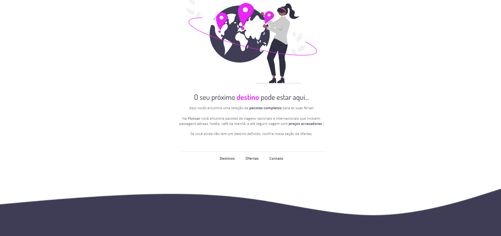
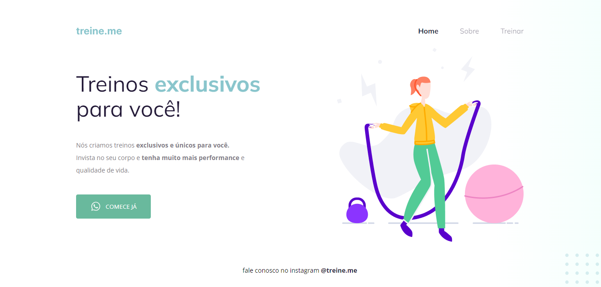

## Explorer

    Projetos desenvolvidos durante os estudos do curso Eplorer da RocketSeat  
     <table>
    <thead>
        <tr>
            <th align="center">
                 
                

                    <small>#</small>
                

            </th>
            <th align="center">
                 
                
 
                    <small>
                        NAME
                    </small>
                

            </th>
            <th align="left">
                
                
 
                    <small>
                    RELEASE DATE
                    </small>
                

            </th>
            <th align="center">
                
                
 
                    <small>
                    PREVIEW
                    </small>
                

            </th>
        </tr>
    </thead>
  <tbody>
      <tr>
        <td>01</td>
        <td><a href="customized-furniture">Customized Furniture</a></td>
        <td>26/01/24<td>
        <td align="center">
        </td>
      </tr>
      <tr>
        <td>02</td>
        <td><a href="flutuar">Flutuar</a></td>
        <td>27/01/24<td>
        <td align="center">
        </td>
      </tr>
      <tr>
        <td>03</td>
        <td><a href="treineme">Treine.me</a></td>
        <td>08/02/24<td>
        <td align="center">
        </td>
      </tr>
    </tbody>
</table>
