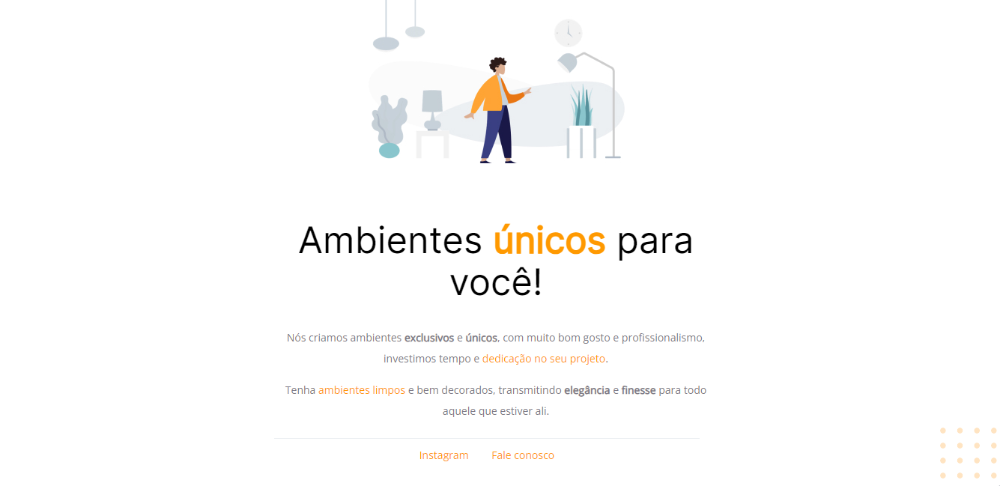
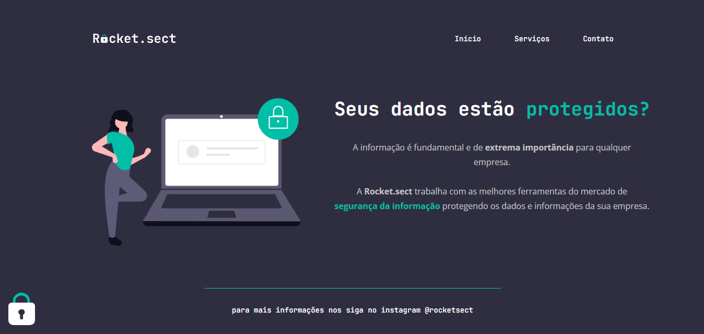
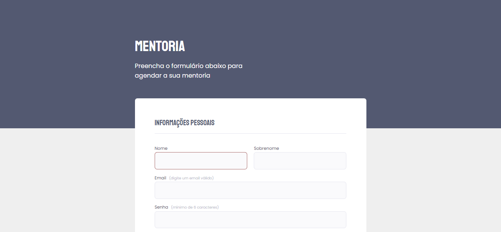
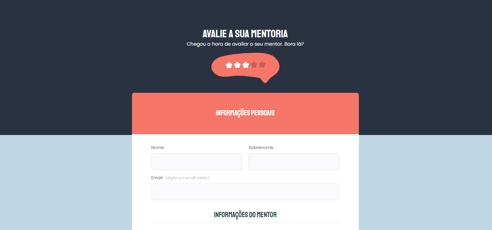
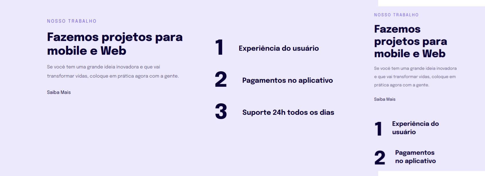
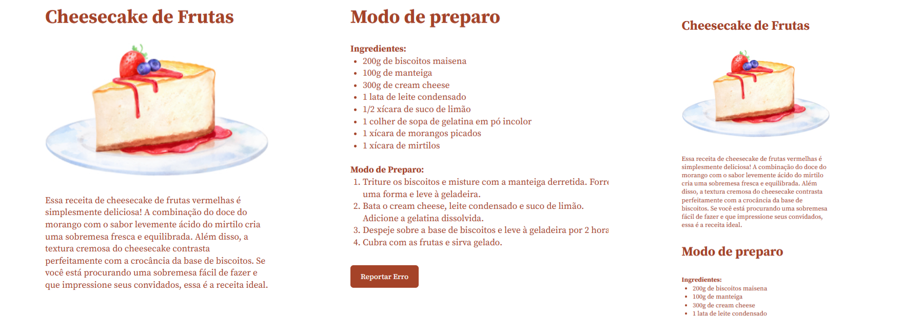

## Explorer

    Projetos desenvolvidos durante os estudos do curso Explorer da RocketSeat  
     <table>
    <thead>
        <tr>
            <th align="center">
                 
                

                    <small>#</small>
                

            </th>
            <th align="center">
                 
                
 
                    <small>
                        NAME
                    </small>
                

            </th>
            <th align="left">
                
                
 
                    <small>
                    RELEASE DATE
                    </small>
                

            </th>
            <th align="center">
                
                
 
                    <small>
                    PREVIEW
                    </small>
                

            </th>
        </tr>
    </thead>
  <tbody>
      <tr>
        <td>01</td>
        <td><a href="01-customized-furniture">Customized Furniture </a></td>
        <td>26/01/24<td>
        
      </tr>
      <tr>
        <td>02</td>
        <td><a href="02-flutuar">Flutuar</a></td>
        <td>27/01/24<td>
        
      </tr>
      <tr>
        <td>03</td>
        <td><a href="03-treineme">Treine.me</a></td>
        <td>08/02/24<td>
        
      </tr>
      <tr>
        <td>04</td>
        <td><a href="04-rocketsect">Rocket.sect</a></td>
        <td>10/02/24<td>
        
      </tr>
      <tr>
        <td>05</td>
        <td><a href="05-event-form">Event Form</a></td>
        <td>20/02/24<td>
        
      </tr>
      <tr>
        <td>06</td>
        <td><a href="06-mentoring-form">Mentoring Form</a></td>
        <td>21/02/24<td>
        
      </tr>
      <tr>
        <td>07</td>
        <td><a href="07-mentoring-evaluation">Mentoring Evaluation</a></td>
        <td>23/02/24<td>
        
      </tr>
      <tr>
        <td>08</td>
        <td><a href="08-responsive-work">Responsive Work</a></td>
        <td>26/02/24<td>
        
      </tr>
      <tr>
        <td>09</td>
        <td><a href="09-cheesecake">Cheesecake</a></td>
        <td>28/02/24<td>
        
      </tr>
    </tbody>
</table>

